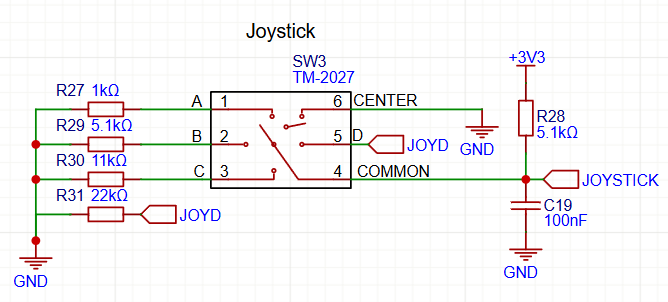
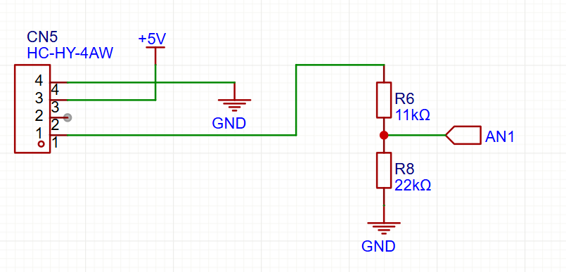

# GoGo Board Version 7 Schematics

Schematic description of the GoGo Board 7 hardware.

---

## Table of Contents

- [1. Processor](#1-processor)
- [2. Bootloader](#2-bootloader)
  - [2.1 Power](#21-power)
- [3. Joystick](#3-joystick)
- [4. Analog Input](#4-analog-input)
- [5. Built-in Sensors](#5-built-in-sensors)
  - [5.1 List of Built-in Sensors](#51-list-of-built-in-sensors)
  - [5.2 Accelerometer & Gyroscope](#52-accelerometer--gyroscope)
  - [5.3 Ambient Light Sensor](#53-ambient-light-sensor)
  - [5.4 Digital Microphone](#54-digital-microphone)
  - [5.5 Temperature & Humidity](#55-temperature--humidity)
  - [5.6 IR Receiver](#56-ir-receiver)
  - [5.7 IR Transmitter](#57-ir-transmitter)
- [6. DC Motor Port](#6-dc-motor-port)
  - [6.1 The DRV8837 Driver Circuit](#61-the-drv8837-driver-circuit)
  - [6.2 The TLC59116IRHBR I2C PWM Driver](#62-the-tlc59116irhbr-i2c-pwm-driver)
  - [6.3 Chain Port (DC Motor Extension)](#63-chain-port-dc-motor-extension)
- [7. Servo / Relay Port](#7-servo--relay-port)
- [8. Expansion Ports](#8-expansion-ports)
  - [8.1 I2C Expansion Port](#81-i2c-expansion-port)
  - [8.2 UART Expansion Port](#82-uart-expansion-port)
  - [8.3 I/O Expansion Port](#83-io-expansion-port)
- [9. Tasmota Core](#9-tasmota-core)
  - [9.1 GPIO Ports](#91-gpio-ports)
  - [9.2 I2C Port](#92-i2c-port)
- [10. RGB LEDs](#10-rgb-leds)
- [11. 1.8 Inch LCD Display](#11-18-inch-lcd-display)

---

---

## 1. Processor

The GoGo Board uses the ESP32-S3 MCU by Espressif (N16R8 variant: 16 MB flash, 8 MB RAM).  
This dual-core processor efficiently handles background tasks.  
A built-in USB module is used for host communication and firmware flashing.

---

## 2. Bootloader

The GoGo Board does not use a USB-to-serial chip.  
Firmware updates are performed over USB using the ESP32-S3's internal USB CDC (virtual serial port) bootloader, activated by holding the Boot button during power-up.

To flash new firmware, use the [Tasmota Web Installer](https://tasmota.github.io/install/).  
See the [Firmware Update Procedure](https://docs.google.com/document/d/1wkHplLRawxpCvvXY5K_7zhaUBPVLWB5iVyL8zbxunkI/edit?tab=t.0#heading=h.g8lrajqe9t70) for details.

You can also use the Arduino IDE (with any generic ESP32-S3 board profile).  
**Note:** Hold the Boot button at power-up to enter download mode.

### 2.1 Power

The GoGo Board provides three 3.3 V voltage regulators (TLV75733PDBVR), each rated at 1 A:
- **Main S3 power:** Feeds the ESP32-S3 and most peripherals.
- **Display power:** Dedicated to the 1.8" LCD display.
- **Co-processor power:** Feeds the ESP32-C3 and related peripherals.

A MOSFET circuit is used for the main On-Off toggle switch.

---

## 3. Joystick

The GoGo Board features a 5-direction joystick (up, down, left, right, press) connected to GPIO4.  
Different resistor values generate unique voltages for each direction, read by the ADC.

A 5.1 kΩ pull-up resistor keeps GPIO4 high when inactive.  
Each direction uses a distinct pull-down resistor, forming a voltage divider for unique ADC readings.

---

## 4. Analog Input

The board provides four analog inputs via white 4-pin Grove ports:
- Vcc (+5 V)
- GND
- Signal

**Voltage Divider:**  
Each input uses a voltage divider (11 kΩ/22 kΩ) to safely scale 5 V signals to the 3.3 V ADC.  
When no sensor is connected, the divider pulls the analog GPIO low, so the reading is zero.

| Sensor | Pin   |
|--------|-------|
| 1      | GPIO1 |
| 2      | GPIO2 |
| 3      | GPIO3 |
| 4      | GPIO5 |

---

## 5. Built-in Sensors

The GoGo Board 7 includes five built-in sensors: four on I2C, one on GPIO.

### 5.1 List of Built-in Sensors

| Sensor                    | Interface | Model            | Description                                                                                 |
|---------------------------|-----------|------------------|---------------------------------------------------------------------------------------------|
| Accelerometer & Gyroscope | I2C       | LSM6DS3TR-C      | 3-axis accelerometer and gyroscope for motion/gesture detection.                            |
| Ambient Light Sensor      | I2C       | LTR-553ALS-01    | Ambient light/proximity sensor with built-in IR emitter.                                    |
| Digital Microphone        | I2S       | SD18OB261-060    | Digital MEMS omnidirectional microphone with I²S output (loudness sensing).                 |
| Temperature & Humidity    | I2C       | GXHT30C          | Digital temperature/humidity sensor (±0.3°C, ±3% RH accuracy).                              |
| IR transmitter & receiver | GPIO      | C414640          | 38 kHz IR remote receiver and directional IR LED transmitter, transistor-driven.            |

---

### 5.2 Accelerometer & Gyroscope

- Uses ESP32 I2C (SDA=GPIO8, SCL=GPIO9).
- Interrupt output is connected to INT-ACC (GPIO47) but unused in firmware.

---

### 5.3 Ambient Light Sensor

- I2C bus (SDA=GPIO8, SCL=GPIO9).
- Reports brightness in lux.
- The LCD screen may interfere in low-light.
- Interrupt output is **not** connected.

---

### 5.4 Digital Microphone

- Digital MEMS mic with I²S output.
- Enables sound/loudness detection.

---

### 5.5 Temperature & Humidity

- I2C bus (SDA=GPIO8, SCL=GPIO9).
- SHT30-compatible sensor.

---

### 5.6 IR Receiver

- Connected via GPIO to ESP32.
- Decodes SONY-compatible IR signals (and any 38 kHz protocol).

---

### 5.7 IR Transmitter

- IR LED with a narrow (15
